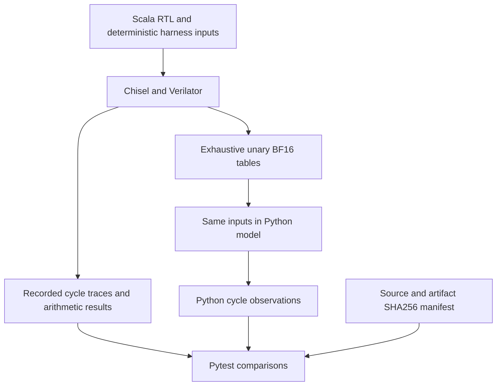

# Matching the Atlas performance model to RTL

This README describes the changes made to `npu-model` to match the RTL in
`sp26-atlas-acc/src/main/scala`: what the hardware implements, how the Python
model represents it, and how the behavior is checked. It covers the scalar
pipeline, assembler, IMEM, LSU, tensor engines, numerical behavior, workload
migration, and the new RTL comparison workflow.

The supported configuration is the default 32-row tensor geometry, MXU0's
custom-FMA systolic array, and MXU1's two-stage inner-product tree. The DMA
engine follows the RTL beat by beat; the off-chip memory behind it is a
parameterized backend awaiting calibration. Production RTL was not changed to
make the model pass. The model and supplied workloads were changed to follow
that RTL.

## Contents

- [Implementation changes](#implementation-changes)
- [Cycle conventions and timing reference](#cycle-conventions-and-timing-reference)
- [Workload and generated-image changes](#workload-and-generated-image-changes)
- [Verification architecture](#verification-architecture)
- [Verification performed](#verification-performed)
- [Commands](#commands)
- [Maintaining the comparison](#maintaining-the-comparison)
- [Scope and remaining approximations](#scope-and-remaining-approximations)

## Implementation changes

Paths in the RTL column below are relative to `../src/main/scala`; model links
are relative to this README.

### Scalar pipeline, control flow, and instruction encoding

| Area | RTL behavior | Model change |
| --- | --- | --- |
| Pipeline | `atlas/scalar/ScalarCore.scala` has instruction fetch followed by combined S1 decode, scalar execution/writeback, and engine launch. | Reworked [`core.py`](../npu_model/hardware/core.py), [`idu.py`](../npu_model/hardware/idu.py), and [`ifu.py`](../npu_model/hardware/ifu.py) around two stages. First fetch is cycle 1; first issue is cycle 2. |
| Branches | `PcControl.scala` redirects fetch while the sequential successor occupies one delay slot. Only taken control flow marks that slot. | Removed extra pipeline/delay-slot assumptions. A control-flow instruction in a marked delay slot raises an error; a branch after an untaken branch is allowed. |
| PC units | PCs and links count instruction words. Branch/JAL displacement is the encoded immediate shifted right by one. JALR adds a signed immediate to a word-addressed register value. | Corrected PC-relative arithmetic, AUIPC, jump links (`PC + 1`), and JALR, including when source and destination registers are the same. Each fetched uop carries its own PC through stalls. |
| DELAY | DELAY issues, then stalls the following instruction for N cycles. | The delay instruction retires at issue; the successor is held for N cycles rather than holding DELAY as an executing scalar operation. |
| DMA.WAIT | S1 waits for the selected channel's busy flag to clear. | Holds instruction and PC while testing the channel flag, which the beat-level DMA engine clears when the slot retires. `dma.config` no longer occupies a channel. |
| Halt | ECALL/EBREAK detection takes priority over frontend stalls and does not count as ordinary retirement. | Matched halt priority and counter behavior. |
| RV32 arithmetic | Scalar writes wrap to 32 bits; signed comparisons/arithmetic shifts use signed RV32 values and shifts mask the count. | Corrected Python integer handling rather than allowing unbounded integers or unsigned comparisons to change control flow. |
| Assembly | Atlas assembly branch/JAL offsets are expressed in words, with their corresponding encoded immediate fields. | Corrected immediate widths and word-to-encoded-offset conversion. Label resolution accounts for LI expansion. Direct typed Python constructors retain raw encoded immediates. Fixed I-type encoding so the destination register is independent of the immediate. |

The assembly distinction is intentional: a source branch offset of `3` words
encodes an immediate of `6`; a direct `BEQ(...)` constructor holds that encoded
value. See [`test_assembler.py`](../tests/test_assembler.py) for range, label,
JALR, and instruction-word checks.

During a tick, S1 consumes the previous edge's state. Scalar operand reads and
engine launch happen before scalar-load writeback, matching the lack of a load
bypass. Fetch uses the old fetch PC even when S1 redirects, preserving the delay
slot. `Core.last_cycle` records fetch/S1 PCs, issue, stall, redirect, and halt
observations for debugging and trace comparison.

### CSR state and retirement

`diplomatic/memory/CSRFile.scala` implements a small internal CSR map rather
than a general array of unrelated CSRs. [`arch_state.py`](../npu_model/hardware/arch_state.py)
now models the implemented addresses, cycle and instruction counters, execution
status, and illegal-instruction PC. Unknown addresses alias the cycle CSR.
Reads observe pre-edge values and explicit writes take priority over automatic
counter increments.

The instruction counter counts S1 launches, not completion of a long-running
engine. This matters when a matmul is still in flight or S1 is stalled. CSR
counter behavior has directed Python tests; the scalar RTL harness ties CSR
read data to zero and does **not** instantiate the actual CSRFile.

### Instruction memory: one live bank

`diplomatic/memory/InstrMem.scala` implements a single 128 KiB synchronous SRAM
with one read port and one write port. It is not a ping-pong/double-buffered
instruction store.

[`InstructionMemory` and `InstructionFetch`](../npu_model/hardware/ifu.py) now
represent that live bank and the held frontend instruction:

- The memory contains 32,768 instruction words; fetch uses the low 15 PC bits.
- A stalled S1 retains its instruction and its original PC. SRAM fetch activity
  can continue without replacing the held instruction.
- Host Get requests share the read port and are blocked while fetch owns it,
  including frontend stalls. Host writes use the separate write port.
- Host responses are registered and retained under response backpressure.
- A host write changes the active instruction bank directly. Instructions written
  beyond the original program length can subsequently execute.
- A high architectural PC can alias a physical word without changing the PC used
  for links or PC-relative arithmetic.
- Same-word read/write collisions raise an explicit undefined-access error.
  Reset clears interface state while preserving SRAM contents.

The Python host-write API supplies decoded instruction objects; it is not a
complete TileLink byte/beat decoder. Uninitialized instruction words terminate
a model program as a convenience; hardware software should halt explicitly.

### Scalar and vector load/store paths

`atlas/lsu/LSU.scala` has independent scalar, VLOAD, and VSTORE paths. Replacing
whole-transfer completion with row-level progress in
[`lsu.py`](../npu_model/hardware/lsu.py) makes intermediate data visibility and
bank contention observable.

For a scalar load issued at T, the registered command accesses VMEM at T+1,
the response is captured at T+2, and the destination register is written at T+3.
A scalar instruction reading that destination during T+3 still sees the old
value. A store writes at T+1. Store address/data are latched when issued.
Byte/halfword selection, signed loads, and SELD's low-byte extraction follow the
RTL. Conflicting scalar writeback is rejected instead of silently choosing a
Python execution order.

VLOAD/VSTORE stream 32 rows and write from T+3 through T+34. Their paths can
operate concurrently when physical-bank rules permit; there is no invented
stall to hide an illegal schedule. An early scalar load can legally observe
old data before a vector store reaches that row. Tests were updated to check
that visibility instead of expecting every such load to be blocked.

The address units are different:

```text
Scalar load/store: byte address = rs1 + signed immediate
Vector load/store: word address = rs1 + signed immediate * 32
                  byte line address = (word address >> 3) * 32
```

Thus byte address `0x2000` becomes VLS base `0x800`, and an offset of 1024 bytes
uses VLS immediate `8`. Vector transfers must satisfy the RTL's 1 KiB alignment
and single-bank range requirements. Default VMEM is 1.5 MiB: six contiguous
256 KiB banks.

### Register banks and scheduling hazards

`atlas/mreg/MregFile.scala` and `atlas/scalar/MregBankTracker.scala` distinguish
logical reservations from physical SRAM ports. The model's
[`bank_conflict.py`](../npu_model/hardware/bank_conflict.py) now does the same.

Logical tracking distinguishes readers and writers rather than using one
undifferentiated register lock. Physical checks enforce the shared 1R1W banks:
`mN` and `m(N+32)` use the same physical bank. Distinct logical registers can
therefore conflict in a cycle even when there is no logical data dependency.
VPU mirrored reads of the same bank and row are coalesced. Conflicting reads,
conflicting writes, and undefined same-location read/write accesses are checked
at the actual row-access cycle. Releases become visible after the clock edge.

These checks enforce the software-scheduled hardware contract. They do not
insert hidden scoreboarding stalls. VPU and XLU also have explicit abort cleanup
for the simulator's optional runtime-error recovery mode.

### MXU0 and MXU1

`atlas/mxu/sa/SystolicArrayTop.scala` and
`atlas/mxu/ipt/InnerProductTreesTop.scala` contain separate port sequencers,
weight slots, accumulation buffers, and compute pipelines.
[`mxu.py`](../npu_model/hardware/mxu.py) now tracks overlapping operations and
per-row source sampling, buffer updates, and destination writes.

Weight/accumulator push and accumulator pop write rows at T+1 through T+32.
MXU0 compute writes accumulator rows at T+63 through T+94; MXU1 writes them at
T+3 through T+34. Port availability, accumulator readiness, and weight-slot
reuse are modeled separately. The SA model advances the PE wavefront so that
weight use follows the relevant cycle rather than snapshotting an entire
matrix only at completion.

Weights are stored as **output columns**: if the source register contains W,
the dot products compute A × Wᵀ. The supplied row-major B workloads therefore
transpose each B tile before pushing it into the weight buffer.

Numerical implementations in [`rtl_math.py`](../npu_model/hardware/rtl_math.py)
follow the default datapaths:

- MXU0: the custom `E4M3Mul` / `E4M3ProdAddBF16` FMA, including exponent
  alignment, sticky bits, normalization, and BF16 rounding after each MAC.
- MXU1: `AnchorAccumulationTree` / `FPUtils` anchor alignment into 32-bit
  integers, seven bits of exponent headroom, reduction, and conversion to BF16.
- Push/pop conversions: explicit FP8/BF16 conversion and special-value handling.

A single ideal FP32 matrix multiply followed by one BF16 cast does not reproduce
these operations. Untimed workload references were adjusted where necessary.

### VPU and independent transpose engine

`atlas/vector/VectorFSM.scala` and `VectorEngineTop.scala` allow two independent
single-input operations, while binary and row-reduction operations occupy both
read slots. Operations sharing a lane box cannot overlap freely.
[`vpu.py`](../npu_model/hardware/vpu.py) models those slots, shared-resource
restrictions, row schedules, and `issue_busy_mask`.

BF16 pair operations require even base registers. VLI all/row initializes a
pair; VLI column/one writes one register. VLI immediates are raw BF16 encodings.
Pack/unpack have their own row cadence and register geometry rather than using
the ordinary BF16 operation schedule.

The eleven unary operations—reciprocal, sqrt, sin, cos, tanh, log2, exp, exp2,
square, cube, and ReLU—use exhaustive RTL-generated tables. Each table maps all
65,536 raw BF16 input encodings to actual output encodings. This preserves the
RTL's approximations and special-value behavior without substituting PyTorch's
mathematical function. Files are gzip-compressed little-endian uint16 arrays
in [`hardware/data`](../npu_model/hardware/data/).

Other arithmetic follows the corresponding hardware rule: add/subtract and
column sums truncate FP32 results to BF16 and canonicalize NaNs; min/max use
ordered-bit comparisons; row sums use the FP32 reduction tree.

`atlas/xlu/XLU.scala` is a separate engine. The new
[`xlu.py`](../npu_model/hardware/xlu.py) models its read-buffer-transpose-write
sequence: requests T+1 through T+32, last response T+33, then writes T+34
through T+65. Transpose can run independently of the VPU subject to MREG hazards.

### FP8 scaling and layout differences

Two superficially similar conversions in RTL have different behavior:

| Property | VPU pack | MXU accumulator pop to FP8 |
| --- | --- | --- |
| Unit E8M0 scale | 127 | 127 |
| Scale direction | Divide by 2^(scale − 127) | Multiply by 2^(scale − 127) |
| BF16 source layout | Successive 16-lane rows in the bank stream | Corresponding rows of the two banks form 32 columns |
| Rounded positive FP8 0x7f encoding | Clamp to 0x7e | Can emit 0x7f, following the current RTL |

The scale exponent is clamped as in RTL. These differences are deliberately
preserved; the model does not normalize both converters to a common ideal
quantizer. Column-blocked attention intermediates use an MXU accumulator
push/pop round trip when a row-major FP8 tile is required.

## Cycle conventions and timing reference

T denotes command issue, not initial fetch. Scalar fixture cycle 1 follows the
host-start edge; first issue is cycle 2. Isolated engine fixture cycle 1 is its
command issue. Trace signals describe the work before the clock edge, except
scalar `next_pc`, which is sampled afterward. A model tick performs that cycle's
work and advances state across the edge.

For a command issued at T (default 32 rows):

| Operation | First write | Last write |
| --- | --- | --- |
| Scalar store | T+1 | T+1 |
| Scalar load register writeback | T+3 | T+3 |
| VLOAD / VSTORE | T+3 | T+34 |
| MXU weight/accumulator push, accumulator pop | T+1 | T+32 |
| MXU0 systolic compute, accumulator rows | T+63 | T+94 |
| MXU1 inner-product compute, accumulator rows | T+3 | T+34 |
| VPU ordinary BF16 operations | T+2 | T+65 |
| VPU row min/max | T+2 | T+33 |
| VPU row sum | T+7 | T+38 |
| VPU column reductions | T+66 | T+129 |
| VPU pack | T+3 | T+65, every other cycle |
| VPU unpack | T+3 | T+66 |
| VLI all/row | T+1 | T+64 |
| VLI column/one | T+1 | T+32 |
| XLU transpose | T+34 | T+65 |


Inclusive execution lengths can be one greater than the last-write offset: a
write at T+34 belongs to a 35-cycle interval including T. Busy/resource-release
boundaries should be taken from the RTL checks, not inferred solely from a
latency number. For example, VPU can accept an appropriate new operation on
its predecessor's final write cycle.

## Workload and generated-image changes

The supplied kernels had assumptions that no longer matched the corrected
hardware model. Changes to [`configs/programs`](../npu_model/configs/programs/)
include:

1. Convert byte-addressed DMA bases to word-addressed VLS bases, using `x31`
   as a scratch register in the migrated assembly; change vector offsets to
   the correct units.
2. Remove redundant odd-register VLI/VMOV operations already covered by the
   preceding even-register pair operation.
3. Transpose row-major weight tiles before MXU weight push.
4. Use E8M0 `127` for unit scale, and arrange BF16/FP8 layouts for the actual
   conversion path.
5. Repair physical-bank conflicts in attention schedules, including aliases
   between registers separated by 32.
6. Update affected numerical references for actual RTL rounding, flushing, and
   unary approximations, without widening tolerances merely to suppress failures.
7. Regenerate all 80 `.bin` and `.hex` assembly images.

[`util/rtl_reference.py`](../npu_model/util/rtl_reference.py) composes untimed
arithmetic primitives for affected workload goldens. These references do not
execute instruction timing or memory scheduling. Some share numerical primitives
with the model, so workload golden checks alone are not independent proof of
arithmetic correctness; the separate RTL fixtures provide that comparison.

## Verification architecture

The repository already had Scala RTL, Mill/Chisel/Verilator infrastructure, and
RTL tests. The dedicated recording harnesses, stored JSON fixtures, Python
cycle comparisons, exhaustive unary tables, regeneration script, and fingerprint
checks were added for this model update.



The Scala harness instantiates real hardware modules, applies deterministic
commands/data, clocks the simulator, and records observed outputs. Expected
traces are not produced by the Python performance model. Python tests recreate
the same input sequence and memory contents and compare every recorded cycle,
including cycles with no access. Wrong data, an extra/missing access, and a
one-cycle shift are independently detectable.

The unary tables are different from test fixtures: they are the model's unary
datapath implementation. Their outputs are exhaustive observations of RTL;
separate trace tests check their integration with reads, issue, and writeback.

### Harness boundaries and observations

| Harness / Python test | Real RTL instantiated | Comparison |
| --- | --- | --- |
| `NpuModelScalarTraceTest` / [`test_rtl_scalar_traces.py`](../tests/test_rtl_scalar_traces.py) | `ScalarCore` | Instruction words, fetch/S1 PCs, issue, redirect result, halt/illegal behavior, and selected scalar operand values exposed through CSR write data. |
| `NpuModelVectorTraceTest` / [`test_rtl_vector_traces.py`](../tests/test_rtl_vector_traces.py) | `VectorEngineTop` | MREG read/write cycles and addresses, every write-data bit, busy, and opcode-specific issue-busy mask. |
| `NpuModelMatrixTraceTest` / [`test_rtl_matrix_traces.py`](../tests/test_rtl_matrix_traces.py) | Full default `SystolicArrayTop` and `InnerProductTreesTop` | All seven command types, MREG accesses/data, accumulator chaining, and overlapping weight push/compute. |
| `NpuModelMemoryTraceTest` / [`test_rtl_memory_traces.py`](../tests/test_rtl_memory_traces.py) | `LSU` and `XluEngine` | Concurrent scalar/VLOAD/VSTORE and transpose accesses, VMEM/MREG addresses and write data, and scalar writeback. |
| `NpuModelArithmeticTraceTest` / [`test_rtl_arithmetic.py`](../tests/test_rtl_arithmetic.py) | Custom FMA, anchor tree, and FPUtils converters | Bitwise arithmetic results for 512 seeded random/boundary cases, covering all 256 scale encodings and FP8 input encodings. |
| `NpuModelUnaryTableTest` | Actual VPU lane boxes through `VectorEngineTop` | All 65,536 BF16 encodings for each of 11 unary operations. |

The scalar harness substitutes a synchronous instruction ROM, idle tensor
engines, a controlled DMA-busy signal, and a fixed scalar memory response
`0x12345678`. Engine harnesses provide synchronous one-cycle memory responses.
The LSU harness includes scalar command/response registers corresponding to
ScalarCore. These environments isolate deterministic on-chip behavior; they do
not instantiate a complete AtlasTile or variable TileLink traffic.

### Additional directed and workload checks

- [`test_rtl_pipeline.py`](../tests/test_rtl_pipeline.py): scalar stage ordering,
  delay slots, stalls, halt priority, signed RV32 behavior, and CSR counters.
- [`test_imem_timing.py`](../tests/test_imem_timing.py): live single-bank memory,
  synchronous reads, host arbitration/backpressure, collision handling, reset,
  instruction holding, high-PC aliases, and writes beyond the loaded image.
- [`test_lsu_rtl_timing.py`](../tests/test_lsu_rtl_timing.py): data visibility,
  scalar lane extraction, writeback hazards, row streaming, and bank conflicts.
- [`test_mxu_rtl_timing.py`](../tests/test_mxu_rtl_timing.py) and
  [`test_vector_rtl_timing.py`](../tests/test_vector_rtl_timing.py): row timing,
  operand sampling, overlap, resource reuse, pair legality, and recovery.
- [`test_mreg_ports.py`](../tests/test_mreg_ports.py) and
  [`test_bank_conflict.py`](../tests/test_bank_conflict.py): logical/physical
  bank hazards, directionality, and edge-delayed release.
- [`test_programs.py`](../tests/test_programs.py): all registered workloads and
  their applicable output goldens.
- [`test_rtl_artifacts.py`](../tests/test_rtl_artifacts.py): recorded source and
  artifact fingerprints, plus consistency of all assembly sources and images.

Tests named `*_rtl_timing.py` are directed Python tests based on RTL behavior;
they do not invoke Verilator. Tests named `test_rtl_*traces.py` replay recorded
Verilator output. Running pytest normally consumes the checked-in fixtures and
does not rebuild the RTL.

## Verification performed

At completion of the implementation update:

- The actual scalar, VPU, SA, IPT, LSU/XLU, and arithmetic harnesses ran
  successfully with Chisel/Verilator.
- Scalar replay covered 14 deterministic cases, including loops, jumps, delay,
  load timing, signed/unsigned arithmetic, and seeded instruction sequences.
- VPU replay covered 46 scenarios: all 29 supported operations, 13 special-value
  scenarios, and four overlap/mirrored/in-place/handoff scenarios.
- Unary table generation covered 11 × 65,536 input encodings.
- Matrix/memory cycle replays and 512 arithmetic cases passed.
- The complete Python suite passed: **323 tests**.
- Source/artifact fingerprint checks and `git diff --check` passed.

These counts describe that validated revision. The following commands reproduce
the checks; future test additions may change the totals.

## Commands

### Environment and fast verification

Run from the `npu-model` directory. Python package tests require Python 3.14+
and the project's dependencies. The example uses the repository's `uv` workflow:

```bash
cd /scratch/kellytou/chipyard/generators/sp26-atlas-acc/npu-model
uv sync

# All Python checks, using already generated RTL fixtures.
OMP_NUM_THREADS=1 uv run python -m pytest -q

# Only recorded RTL comparisons and artifact consistency.
OMP_NUM_THREADS=1 uv run python -m pytest -q \
  tests/test_rtl_scalar_traces.py \
  tests/test_rtl_vector_traces.py \
  tests/test_rtl_matrix_traces.py \
  tests/test_rtl_memory_traces.py \
  tests/test_rtl_arithmetic.py \
  tests/test_rtl_artifacts.py

# Fingerprints only; this command needs only the Python standard library.
python3 scripts/regenerate_rtl_fixtures.py --check
```

With an existing compatible virtual environment, replace `uv run python` with
that environment's Python. `OMP_NUM_THREADS=1` limits overhead for the many small
tensor operations in these tests.

### Regenerate actual Verilator traces and unary tables

Java, Verilator, and the dependencies needed by the parent accelerator's Mill
build must be available. The local Chipyard environment used for verification
provides tools under `.conda-env/bin`:

```bash
cd /scratch/kellytou/chipyard/generators/sp26-atlas-acc/npu-model
export PATH="/scratch/kellytou/chipyard/.conda-env/bin:$PATH"
java -version
verilator --version

python3 scripts/regenerate_rtl_fixtures.py
python3 scripts/regenerate_rtl_fixtures.py --check
OMP_NUM_THREADS=1 uv run python -m pytest -q
```

The regeneration script:

1. Copies the canonical harnesses from `tests/rtl/scala/` into a temporary
   directory under the parent accelerator's `src/test/scala/atlas/` tree.
2. Runs the parent `mill --no-server atlas.test.testOnly` with the six suites
   listed in `scripts/regenerate_rtl_fixtures.py`.
3. Lets those suites record the JSON traces and regenerate unary tables.
4. Removes its temporary harness directory.
5. Writes and checks SHA256 provenance after successful simulation.

Expect several minutes, mainly for compiling the full 32×32 MXUs. Initial build
setup may also need dependency downloads. Use the script rather than invoking a
bare test class directly: the canonical harnesses live in the model repository
and are normally outside Mill's test-source tree.

Generated artifacts are `tests/rtl/{scalar,vector,sa,ipt,memory}_traces.json`,
`tests/rtl/arithmetic.json`, `npu_model/hardware/data/*.bin.gz`, and
`tests/rtl/provenance.json`. `scalar_cases.json` is an input specification, not
an output automatically reassembled by the regeneration script.

### Assemble workloads and check their images

```bash
# All 80 source files, from the model directory.
bash scripts/assemble_all.sh

# Or regenerate one changed workload.
uv run python scripts/assemble.py \
  -p npu_model/configs/programs/asm/gemma_mlp.S \
  --out-bin npu_model/configs/programs/bin/gemma_mlp.bin \
  --out-hex npu_model/configs/programs/hex/gemma_mlp.hex

OMP_NUM_THREADS=1 uv run python -m pytest -q \
  tests/test_assembler.py tests/test_rtl_artifacts.py tests/test_programs.py
```

## Maintaining the comparison

Treat RTL as the reference. When changing RTL or a harness, regenerate the
fixtures and review the resulting differences, then update the Python behavior
and tests as appropriate. Regeneration alone does not make the model correct;
the subsequent comparisons must pass.

For scalar scenarios, keep `source` and `words` in `scalar_cases.json` consistent.
The RTL executes the stored words; Python assembles the source and first checks
that it produces those same words. Editing only the source is insufficient.

The provenance manifest records hashes for Scala sources in the parent RTL and
FP dependency trees, the canonical harnesses, JSON fixtures, and unary tables.
`--check` validates the recorded files and does not run a simulation. It is a
staleness/integrity check, not an equivalence proof. A standalone checkout
without adjacent RTL checks artifacts without requiring those RTL sources.
Keep fixtures, tables, harnesses, and provenance together in version control.

If a replay fails, the reported case/cycle and field distinguish a timing/address
problem from a numerical one. Check the first mismatching cycle. If only a
workload fails, check address units, pair layout, physical-bank aliases, weight
orientation, and the reference's rounding assumptions before changing a latency
or loosening a tolerance.

## Scope and remaining approximations

This verification is directed unit/engine comparison, not exhaustive full-system
formal equivalence. In particular:

- IMEM host behavior and CSR counters have directed Python coverage, not a
  real-RTL full TileLink IMEM/CSR integration trace.
- Engine harnesses supply deterministic memory responses. Full-chip arbitration,
  host command traffic, and arbitrary combinations of concurrent engines are
  not exhaustively verified.
- Geometry and pipeline variations beyond the supported defaults need their own
  timing changes and regenerated reference traces.
- Unary mappings are exhaustive in their input encoding; random arithmetic and
  engine traces do not exhaust every multi-input combination or program.
- The model's uninitialized-IMEM termination and decoded-instruction host-write
  interface are simulator conveniences.

### DMA engine matched; off-chip memory parameterized

The DMA engine is now modeled beat for beat after `diplomatic/memory/DMA.scala`
and the `Vmem.scala` grant logic: eight command slots, in-order beat dispatch
with up to 64 outstanding TileLink beats, out-of-order responses, per-slot
retirement, per-beat VMEM writes and reads subject to LSU priority, and
`dma.config` applied at issue. See [DMA in rtl-timing.md](rtl-timing.md#dma-beat-level-engine-parameterized-memory).
`dma_traces.json` records the actual engine and VMEM arbiter against a
scripted TileLink responder and scripted LSU bank traffic; that harness is
compiled by Chipyard's sbt build because the DMA RTL depends on rocket-chip.

The memory behind the TileLink port is a pluggable backend
(`npu_model/hardware/memory_backend.py`) because it is an environment choice,
not Atlas RTL. The supported target is VCS simulation of EE290SimConfig. The
standard Chipyard `make run-binary` flow always passes `+dramsim`, so the RTL
memory is DRAMSim2 (DDR3 `micron_64M_8B_x4_sg15`, open-page, low-power mode
on, 666 MHz DRAM clock against the 500 MHz core; see `variables.mk` and the
`.out` banner). The default backend, `curve`, is the TA's suggestion of a
coarse bandwidth-latency model after the Mess simulator (MICRO 2024): the
memory is a family of measured latency-against-bandwidth curves per read
percentage in Mess's JSON format, a window of delivered beats selects the
operating point, the mix of issued beats selects the curve, and responses
are paced at the curve's peak. The default curve file,
`npu_model/configs/memory_curves/ee290sim_vcs_probe.json`, was measured on
that path with one change: DRAMSim2 refresh disabled.
`scripts/gen_dma_probe_programs.py` generates the DMA-side version of the
Mess benchmark (a timed 32 B probe on channel 0 against background traffic
on channels 1 to 7 at a sweep of sizes and load/store mixes; CSR_DBG1 carries
the probe cycles in its low half and the traffic-phase cycles in its high
half), 38 programs ran on VCS with refresh off, and
`scripts/fit_dma_probe_curve.py` turned the logs into the file: a lead-off
latency of 46 cycles per Get and 42 per Put, and a streaming rate of about
23 cycles per 32-byte beat. Nothing is fitted. The curve reproduces single
32 B to 4 KiB transfers and eight-channel bursts within about 85 cycles,
a total error of 656 cycles over the 18 perf_dma programs, where a
two-server queue fitted to the same measurements reached 842. Measured
values (`dbg1_cycles` from the perf_dma programs, refresh off):

| program | RTL cycles | model cycles |
| --- | ---: | ---: |
| one 32 B load | 55 | 51 |
| one 1 KiB load / store | 797 / 724 | 779 / 721 |
| one 4 KiB load / store | 3056 / 2820 | 3033 / 2801 |
| eight 1 KiB loads / stores / mixed | 6120 / 5509 / 5872 | 6037 / 5574 / 5851 |
| four dependent 1 KiB loads | 3177 | 3119 |

The same probe programs measure the bringup board later without code
changes; point `dma_memory_params = {"curves": "<file>"}` at the result.

Why refresh is excluded: DRAMSim2 refreshes every 7.8 us and a refresh
(tRFC = 107 DRAM cycles, about 80 core cycles) blocks the rank, so a transfer
window pays 0 to about 130 extra cycles depending on where it falls relative
to the absolute simulation time. That phase depends on things outside the
program's control: how many IMEM words the host writes before start, host
boot timing, and (through `+ntb_random_seed_automatic`) the VCS seed. The
earlier "VMEM reuse" residual was this effect misread: programs that reused a
VMEM slot used a one-instruction `ADDI` while the fresh-slot variants used a
two-instruction `LI`, which shifted the window. Controls proved it:
`perf_dma_load_1k_serial2_vslot1i` (fresh slot, one instruction) and
`..._same2i` (same slot, two instructions) measure 1641 and 1642, while
`..._padstart` (one NOP before the window) measures 1760. With refresh off
every serial2 variant measures 1548 and fixed seeds reproduce exactly.
`DMA.scala` and `VMEM.scala` keep no state keyed by line address, as expected.

Two things learned from measuring the curve on the DMA side. First, the
probe is one of the engine's own beats behind in-order dispatch, so every
loaded latency it reports is its wait behind the engine's backlog, which
grows with the background transfer size rather than with bandwidth; the fit
script therefore tags the file `latencyMode: "unloaded"` and the backend
applies only each mix's lead-off latency and lets the pacing reproduce the
queueing. A curve measured by another client, or supplied by a vendor for
the board's memory, keeps the default `"knee"` mode, which applies the rise
before the knee and stops short of the backlog wall. Second, a handful of
single-beat commands drain at about 16 cycles per beat while any tile stream
runs at 24, whether the tiles are contiguous or 64 KiB apart, so points with
background transfers under 128 B are left out of the curve (`--min-size`);
no workload sends 32 B tiles and including them would set a peak no stream
reaches. Why DRAMSim2 serves seven scattered single beats faster than a
stream is not identified and does not affect tile workloads.

Two smaller DRAMSim2 effects remain in the measurement. Low-power mode costs
about 8 cycles per command plus about 0.7 cycles per beat (30 cycles on a
1 KiB load, 237 on eight 1 KiB loads); it is deterministic and the measured
lead-off and peak include it. The 4:3 DRAM-to-core clock ratio makes beat timing depend on the
phase at which a transfer starts, which jitters a 1 KiB transfer by about
15 cycles between runs whose host boot differs; the model cannot know the
phase. To reproduce the fit, run VCS with
`EXTRA_SIM_FLAGS='+dramsim_ini_dir=.../baremetal/dramsim2_ini_norefresh'`
(it is parsed after the default `+dramsim_ini_dir`, so the last one wins) and
`EXTRA_SIM_OUT_NAME=norefresh` to keep separate logs. Runs with the default
ini carry the refresh offset on top of these numbers. The taped-out chip
(serial TileLink link to FPGA DRAM) is not modeled.

Two address conventions were migrated to the RTL's:

- AtlasCore takes the DMA VMEM operand as a 32-bit word address (line =
  bits [18:3]). The ISA definition and the engine now do the same, and all 80
  supplied workloads were rewritten: every register that held a VMEM byte
  address for a DMA now holds the word address, and the `srli x31, xN, 2`
  that derived `vload`/`vstore` bases from it became `addi x31, xN, 0`.
  Constants that no longer fit one `lui` cost one extra prologue instruction
  in some workloads; no timed region changed.
- DRAM is the RTL's: `{dma.base, x[rs]}` indexes a 64 GiB window at
  `0x8000_0000` (`ArchStateConfig.dram_base`/`dram_size`, backed by a
  page-sparse store). The workloads set `dma.config` base 1 before their first
  transfer so their existing 32-bit DRAM offsets land at 4 GiB, which is where
  `Program.memory_regions` and `golden_result` are now placed
  (`Program.dram_base`). Baremetal programs run unmodified at `0x9000_0000`.

The spec's "Baseline Transfer Formulas" describe the previous closed-form
estimate. They remain in `dma.py` as `dma_transfer_cycles` and friends for
reference but no longer drive the engine.

`DMAStallProgram` issued two zero-byte transfers, which `DmaEngine` asserts on;
its sizes were corrected and its images regenerated.
